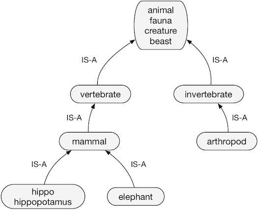
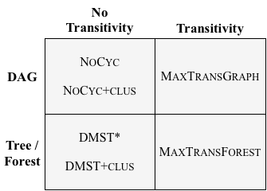

# tax-org

Code and data from Cocos et al. "Comparing Constraints for Taxonomic Organization" (NAACL 2018)

If you use the resources here, please cite our paper:

```
@InProceedings{N18-1030,
  author =  "Cocos, Anne
             and Apidianaki, Marianna
             and Callison-Burch, Chris",
  title =  "Comparing Constraints for Taxonomic Organization",
  booktitle =  "Proceedings of the 2018 Conference of the North American Chapter of the Association for Computational Linguistics: Human Language Technologies, Volume 1 (Long Papers)",
  year =  "2018",
  publisher =  "Association for Computational Linguistics",
  pages =  "323--333",
  location =  "New Orleans, Louisiana",
  url =  "http://aclweb.org/anthology/N18-1030"
}
```

## Intro

Taxonomies encode knowledge about semantic hierarchies. For example,
a *mosquito* *IS-A* *insect* and an *insect* *IS-A* *organism*.



More formally, a taxonomy is a graph where the nodes are *entities* (like 
*mosquito*, *insect*, and *organism*), and directed edges from entity
node *x* to entity node *y* indicate that the relationship (*x* *IS-A* *y*) exists.

There has been a lot of work in the NLP community on trying to build
taxonomies automatically. Generally, we can think about automatic taxonomy
induction as having three sub-tasks: *entity extraction* (choosing the nodes
in the graph), *relation prediction* (predicting which node pairs have an *IS-A*
relationship), and *taxonomy organization*. The code in this repo focuses
on that final step.

Taxonomy organization aims to choose the edges that should appear in a taxonomy. Its
input is a set of entities $$E$$ and predicted relations between entity pairs $$R \in E \times E$$.
Its output is the graph $$G(E, R^\prime)$$ where the subset of edges $$R^\prime$$ forms 
a "valid" taxonomy. What "valid" means can differ depending on the algorithm used. Different
versions of "valid" vary by the structural constraints imposed by each algorithm.

The goal of our paper was to compare different taxonomy organization algorithms having
different structural constraints. Specifically, we tried algorithms that varied by:

1. Whether the final graph should be a directed acyclic graph (DAG) or a tree
2. Whether or not the final graph must explicitly contain transitive edges (i.e. if (*i-->j*) is an edge, and (*j-->k*) is an edge, then (*i-->k*) must also be an edge).

This repo contains code for six algorithms, organized along those two axes:



## Contents

- `/taxdata` -- contains test dataset, predicted relations, and synonym clusters used in the paper
  - `/taxdata/terms_test` -- entity sets in the test set
  - `/taxdata/terms_val` -- entity sets in the validation set
  - `/taxdata/gs_terms` -- filtered entity sets, including only terms appearing in WordNet (for evaluation)
  - `/taxdata/gs_taxo` -- 'gold-standard' taxonomies for entity sets in `gs_terms`, containing WordNet direct and transitive edges
  - `/taxdata/clusters` -- consolidated synonym clusters generated by combining all terms with PARAGRAM (Wieting et al. 2015) embedding cosine similarity >= 0.76
  - `/taxdata/relations` -- contains predicted relations (equiv[synonym], hypernym, and entmax[max(equiv, hypernym)]) for term pairs in the entity sets. Hypernym relations were predicted using HypeNET (Shwartz et al. 2016) and equiv relations give cosine similarity (min 0) of PARAGRAM (Wieting et al. 2015) embeddings 
- `/src` -- code

## Getting started

- Install requirements from `src/requirements.txt`
- Install required packages without pip support:
  - The transitive algorithms (MaxTransGraph and MaxTransGraph) are implemented with the [Gurobi](http://www.gurobi.com) optimization library. To run those models, you'll need to install Gurobi (free academic licenses available) and its Python API, `gurobipy`. 
  - The DMST algorithms use the implementation of the Chu-Liu-Edmonds algorithm from the [dependency\_decoding](https://github.com/andersjo/dependency_decoding) package; you'll need to install this too.

## Running experiments

Run experiments to generate taxonomies for the entity sets in `/taxdata/terms_test` by running:

```
./src/run_experiments.sh
```